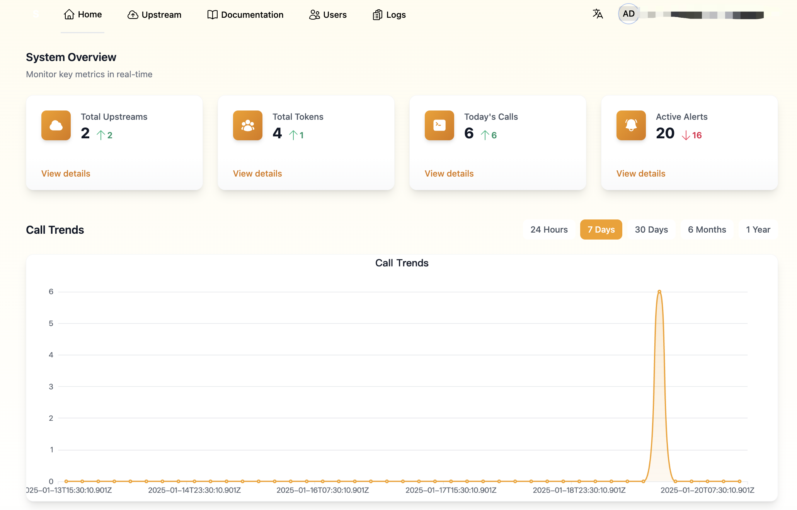

# SynapseHub - 智能 LLM API 网关与管理平台

<div align="center">
  <h1>♻️</h1>
  <p><strong>一站式大语言模型 API 管理与调度平台</strong></p>
</div>

[English](README_EN.md) | [日本語](README_JP.md) | 简体中文




## 🌟 简介

SynapseHub 是一个强大的 LLM API 网关和管理平台，旨在简化企业和开发者与各类大语言模型的交互方式。无论您是需要管理多个 API 密钥、平衡不同模型的负载，还是统一监控和记录模型调用，SynapseHub 都能满足您的需求。

## ✨ 核心特性

### 🚀 智能路由与负载均衡
- **多模型统一接入**: 支持 OpenAI风格（目前计划支持dify风格） LLM 的统一接入
- **智能负载分发**: 支持轮询、随机等多种负载均衡策略


### 🔒 安全与访问控制
- **细粒度权限管理**: 完善的用户角色和权限控制系统
- **API 密钥管理**: 安全的 API 密钥存储和管理机制
- **请求鉴权**: 支持多种认证方式，确保 API 调用安全
- **访问日志审计**: 详细的请求日志记录和审计功能

### 📊 监控与分析
- **实时监控**: 监控模型性能、响应时间、错误率等关键指标
- **使用量统计**: 详细的 API 调用统计和费用分析
- **日志管理**: 集中化的日志收集和查询功能
- **告警机制**: 可配置的告警规则和通知方式

### 🔌 易用性与集成
- **简单部署**: 支持 Docker 快速部署
- **友好的管理界面**: 直观的 Web 管理控制台
- **标准化接口**: 兼容 OpenAI API 、 dify API 格式，便于集成
- **可扩展性**: 支持自定义模型接入和功能扩展

## 🎯 适用场景

### 企业应用
- **多模型统一管理**: 统一管理企业内部使用的各类 LLM 模型
- **成本控制**: 通过智能调度和监控优化模型使用成本
- **安全合规**: 满足企业对数据安全和访问控制的要求

### 开发团队
- **API 密钥管理**: 集中管理和监控团队的 API 密钥使用
- **开发测试**: 便捷切换不同模型进行开发和测试
- **使用分析**: 追踪和分析团队的 API 使用情况

### 服务提供商
- **服务聚合**: 为客户提供统一的 LLM 服务接入点
- **资源调度**: 智能分配和管理计算资源
- **服务监控**: 全面监控服务质量和使用情况

## 🚀 快速开始

### 环境要求
- Docker 和 Docker Compose
- 或者独立安装:
  - Node.js 16+
  - MongoDB 4.4+
  - Redis 6+

### Docker 一键部署
```bash
# 克隆项目
git clone https://github.com/yourusername/synapsehub.git

# 进入项目目录
cd synapsehub

# 启动所有服务
docker-compose up -d

# 查看服务状态
docker-compose ps

# 查看服务日志
docker-compose logs -f
```

服务端口说明:
- Web 界面: http://localhost:3000
- API 服务: http://localhost:3088
- MongoDB: localhost:26889
- Redis: localhost:6390

### 手动安装部署
```bash
# 克隆项目
git clone https://github.com/yourusername/synapsehub.git

# 安装依赖
cd synapsehub

cd web
npm install
npm run dev

cd api

# 配置环境变量
cp .env.example .env
# 编辑 .env 文件配置必要的参数

npm install
npm run dev

# 启动服务
npm run dev
```


## 🤝 贡献

我们欢迎任何形式的贡献，包括但不限于：
- 提交问题和建议
- 改进文档
- 提交代码
- 分享使用经验

## 📄 许可证

本项目采用 Apache 2.0 许可证。

## 🌟 Star History

[](https://star-history.com/#yourusername/synapsehub&Date)

---

<div align="center">
  <strong>如果这个项目对您有帮助，请给我们一个 Star ⭐️</strong>
</div>
