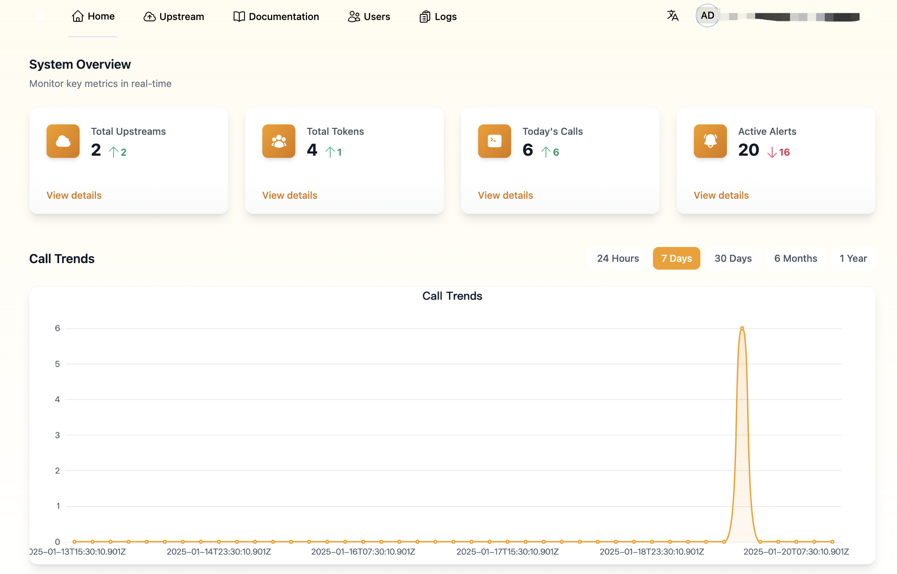

# 🧠 SynapseHub - 次世代LLMインテリジェンスルーター

[English](README_EN.md) | [简体中文](README.md) | 日本語

### エンタープライズグレードのインテリジェントAPIゲートウェイ：OpenAI/Difyスタイルの大規模モデルの統合アクセス、インテリジェントスケジューリング/コスト最適化/セキュリティ制御LLMハブシステムを実現

<div align="center">
  
  
  
  <br><br>
  
[](https://github.com/hikariming/synapsehub)

</div>



> **LLM管理を呼吸のように簡単に**  
> エンタープライズLLM APIインテリジェントスケジューリングシステム | OpenAI/Dify互換インターフェース | マルチモデルハイブリッドオーケストレーションエキスパート

## 🚀 なぜSynapseHubを選ぶのか？

1. **エンタープライズレベルの同時実行ソリューション** - 数千QPSをサポートするインテリジェントモデルオーケストレーション
2. **効率300%向上** - マルチモデル並列応答+動的キャッシュ高速化
3. **フルディメンショナルAIハブ** - 会話監査/インテリジェント負荷/マルチテナント分離/サーキットブレーカーアラーム統合プラットフォーム

### 💡 エンタープライズコアバリュー
✅ **セキュリティ監査**  
✅ **インテリジェントQPS制御**  
✅ **マルチテナント分離システム**  
✅ **リアルタイムコストダッシュボード**

## 🌟 機能マトリックス

| 機能マトリックス | コアアドバンテージ |
|-----------------|-------------------|
| **インテリジェントルーティング** | トークンベースのモデル動的選択 |
| **トラフィックオーケストレーション(開発中)** | リクエスト分割/マージ/リトライ戦略 |
| **キーサーキットブレーカー** | 異常APIKeyトラフィックの自動遮断 |
| **コスト最適化(開発中)** | トークンによるリアルタイム課金+予測分析 |
| **観測システム** | 多次元モニタリング+インテリジェントアラート+トレース追跡 |
| **拡張プロトコル** | OpenAI/Difyネイティブサポート |

## 🌟 概要

SynapseHubは、企業や開発者が様々な大規模言語モデルと対話する方法を簡素化するための強力なLLM APIゲートウェイおよび管理プラットフォームです。複数のAPIキーの管理、異なるモデル間の負荷分散、モデル呼び出しの統合監視とログ記録など、あらゆるニーズに対応します。

## ✨ 主な機能

### 🚀 スマートルーティング & 負荷分散
- **マルチモデル統合**: OpenAIスタイル（Difyスタイル対応予定）LLMの統合アクセス
- **インテリジェント負荷分散**: ラウンドロビンやランダムなど、複数の負荷分散戦略をサポート

### 🔒 セキュリティ & アクセス制御
- **きめ細かな権限管理**: 包括的なユーザーロールと権限制御システム
- **APIキー管理**: 安全なAPIキーの保存と管理
- **リクエスト認証**: 複数の認証方式をサポート
- **アクセス監査ログ**: 詳細なリクエストログと監査機能

### 📊 モニタリング & 分析
- **リアルタイムモニタリング**: モデルのパフォーマンス、応答時間、エラー率を監視
- **使用統計**: 詳細なAPI呼び出し統計とコスト分析
- **ログ管理**: 集中化されたログ収集とクエリ
- **アラートシステム**: 設定可能なアラートルールと通知方法

### 🔌 使いやすさ & 統合
- **簡単なデプロイ**: Docker クイックデプロイメントのサポート
- **使いやすいインターフェース**: 直感的なWeb管理コンソール
- **標準化されたAPI**: OpenAI API、dify API 形式との互換性
- **拡張性**: カスタムモデルの統合をサポート

## 🎯 利用シーン

### 企業利用
- **統合モデル管理**: 企業内で使用される様々なLLMモデルを一元管理
- **コスト管理**: スマートなスケジューリングとモニタリングによるモデル使用コストの最適化
- **セキュリティコンプライアンス**: データセキュリティとアクセス制御に関する企業要件を満たす

### 開発チーム
- **APIキー管理**: チームのAPIキー使用状況を一元管理・監視
- **開発テスト**: 開発とテストのために異なるモデルを簡単に切り替え
- **使用分析**: チームのAPI使用状況を追跡・分析

### サービスプロバイダー
- **サービス集約**: クライアントに統一されたLLMサービスアクセスポイントを提供
- **リソーススケジューリング**: コンピューティングリソースのインテリジェントな割り当てと管理
- **サービスモニタリング**: サービス品質と使用状況の包括的な監視

## 🚀 クイックスタート

### 必要要件
- DockerとDocker Compose
- または個別インストール:
  - Node.js 16+
  - MongoDB 4.4+
  - Redis 6+

### Dockerデプロイメント
```bash
# リポジトリのクローン
git clone https://github.com/hikariming/SynapseHub.git

# プロジェクトディレクトリに移動
cd synapsehub

# すべてのサービスを起動
docker-compose up -d

# サービスステータスの確認
docker-compose ps

# ログの表示
docker-compose logs -f
```

サービスポート:
- Web UI: http://localhost:3000
- APIサービス: http://localhost:3088
- MongoDB: localhost:26889
- Redis: localhost:6390

### 手動インストール
```bash
# リポジトリのクローン
git clone https://github.com/hikariming/SynapseHub.git

# 依存関係のインストール
cd synapsehub

cd web
npm install
npm run dev

cd api

# 環境変数の設定
cp .env.example .env
# .envファイルを編集して必要なパラメータを設定

npm install
npm run dev

# サービスの起動
npm run dev
```

## 🤝 コントリビューション

以下を含むあらゆる形式の貢献を歓迎します：
- 問題提起と提案
- ドキュメントの改善
- コードの貢献
- 使用経験の共有

## 📄 ライセンス

本プロジェクトはApache 2.0ライセンスの下で提供されています。

## 🌟 スター履歴

[](https://star-history.com/#hikariming/SynapseHub&Date)

---

<div align="center">
  <strong>このプロジェクトがお役に立てば、ぜひスター⭐️をお願いします</strong>
</div> 